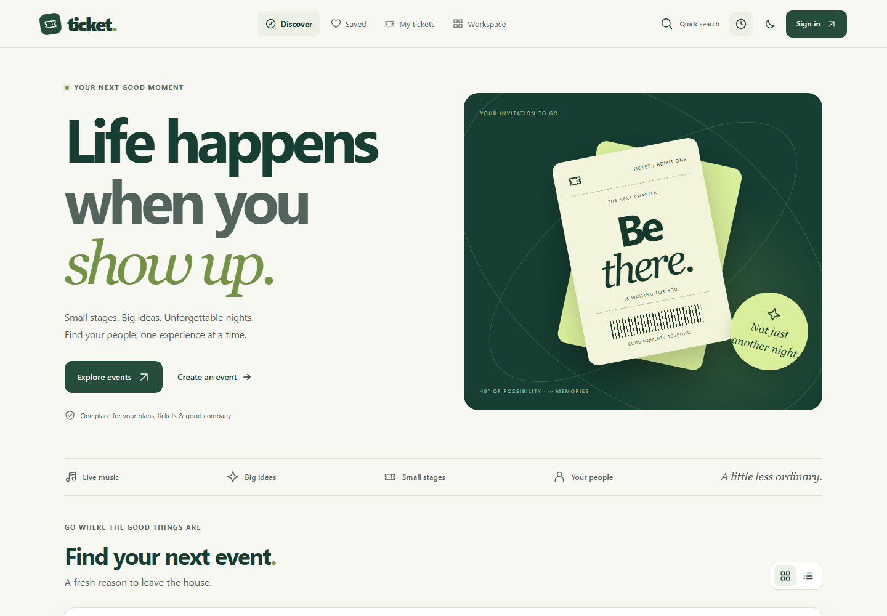
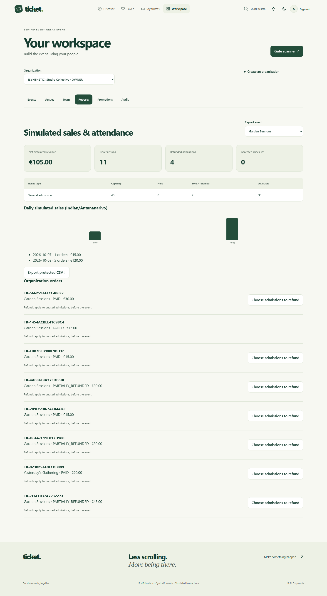
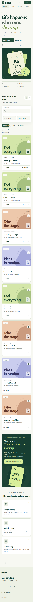
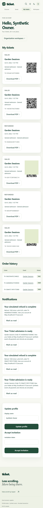
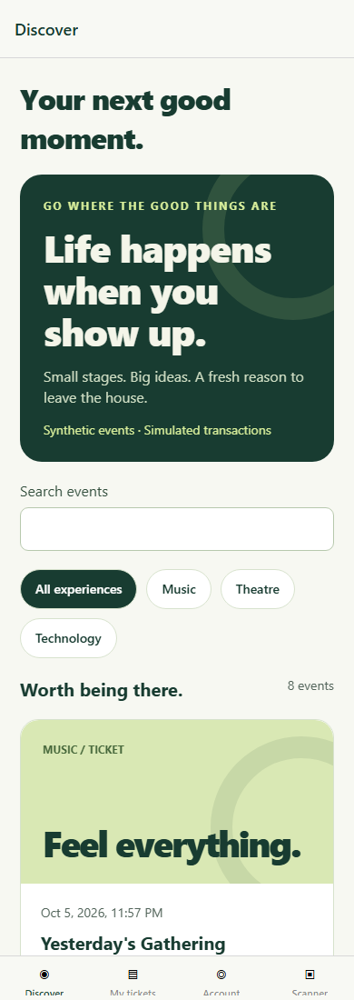
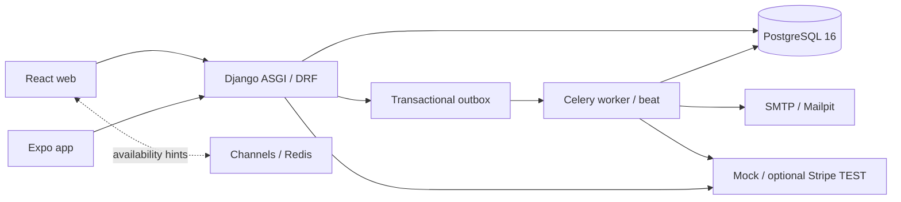

# Ticket · Good moments, together.

An end-to-end event ticketing portfolio: discover an experience, reserve a place, keep your ticket and bring people together. React web, a dedicated Expo attendee/scanner app and a transactional PostgreSQL backend share one API. Transactions are simulated; Stripe TEST is optional. No real money is charged.



## The experience

- Editorial light/dark interface with original CSS ticket artwork, category posters and a responsive layout tested at 320, 390, 768 and 1440 pixels.
- Animated floating tickets, scroll reveals, loading skeletons, hover feedback and page transitions. A pause control and OS reduced-motion support keep animation optional.
- Shareable URL filters, ordering, grid/list views, browser-local saved events and keyboard quick search (`Ctrl/Cmd+K`, `Tab`, `Esc`). No account is needed for a shortlist.
- Guided checkout with seat-stage orientation, accessible numbered seats, selection totals, a live hold countdown, promotion codes and server-confirmed payment updates.
- Organizer workspace with role-based controls, inventory, actual daily sales charts, protected exports, selected-admission refunds and audit history.
- Matching native discovery cards, press feedback, reduced-motion-aware transitions and pull-to-refresh; authenticated wallet and assigned-event scanner.

<details>
<summary>See the running interfaces</summary>




 



The Expo capture is its web target using the real API, not a physical-device capture. All data is synthetic; wallet QR codes are masked. Artwork is self-created CSS/native views, with no external image requests.

</details>

## Run locally

Requirements: Docker with Compose v2, Python 3 for environment setup, Node.js 24.15+ for client development. No payment, email or cloud account is needed. Docker starts migrations before the API and workers.

Windows PowerShell (also works without Make):

```powershell
git clone https://github.com/toaandri/ticket.git
cd ticket
python infra/scripts/setup_env.py
docker compose up --build -d
docker compose exec backend python manage.py seed_demo
```

The setup generates two independent signing keys and never overwrites an existing `.env`. Keep that file private. macOS/Linux with Make:

```sh
git clone https://github.com/toaandri/ticket.git
cd ticket
make setup       # creates .env with independent random signing keys
make up          # builds, migrates, then starts API, web, workers and Mailpit
make seed        # prints a generated password for synthetic demo accounts
```

| Service | URL |
| --- | --- |
| Web | http://localhost:5173 |
| API | http://localhost:8000/api/v1/ |
| OpenAPI / Swagger | http://localhost:8000/api/schema/swagger-ui/ |
| Local email inbox | http://localhost:8025 |
| PostgreSQL / Redis on the host | localhost:5433 / localhost:6380 |

Sign in as `demo-owner@ticket.example`, `demo-manager@ticket.example`, `demo-editor@ticket.example`, `demo-finance@ticket.example`, `demo-scanner@ticket.example` or `demo-attendee@ticket.example`, using the password printed by `make seed`. These are verified synthetic accounts; none is a platform administrator. Repeating the seed preserves accounts, passwords and transactions. A development-only reset creates another dataset while retaining financial and audit history:

```sh
docker compose run --rm backend python manage.py seed_demo --reset-demo --confirm-reset
```

Choose Garden Sessions, select general admission tickets, hold them, continue to checkout and pay in test mode. The wallet contains authorized QR and PDF downloads. On a numbered event, choose an exact seat. The hold lasts up to ten minutes and is never extended by checkout. Mock decline, pending, delayed and timeout scenarios are available only in development. Pending mock outcomes can be completed using the demo control; they are deliberately not auto-approved by a timer.

The organizer workspace creates venues, numbered layouts, drafts and ticket types, publishes events, manages invitations and roles, assigns scanners, manages promotions, shows reports, exports protected CSV, refunds selected unused admissions and cancels events. Finance can read reports; Scanner sees assigned events without finance access. A platform administrator uses explicit moderation endpoints and has no implicit organization access. Web credentials are kept in memory, so reloading the browser requires signing in again; preferences and saved event IDs are the only browser-local storage.

## Mobile

```sh
cd mobile
npm ci
# Android emulator: http://10.0.2.2:8000/api/v1
# iOS simulator: http://localhost:8000/api/v1
# Phone: replace localhost with the computer's LAN address
EXPO_PUBLIC_API_BASE_URL=http://192.168.1.10:8000/api/v1 npm start
```

Use an Expo Go version compatible with SDK 57, or a local development build. On a phone, set the LAN hostname in root `.env` `ALLOWED_HOSTS` and the matching web origins in `CORS_ALLOWED_ORIGINS`, then restart the backend. Phone and computer must reach the same LAN. Open the Expo QR in Expo Go; the app has Discover, My tickets, Account and Scanner tabs. Native refresh credentials use SecureStore; access tokens remain in memory. Camera permissions are requested when scanning. Admission is online only. PDF downloads are authenticated, shared through the OS and removed from app cache afterward.

PowerShell uses `$env:EXPO_PUBLIC_API_BASE_URL='http://192.168.1.10:8000/api/v1'`, then `npm start`. Replace the address with your computer's LAN IP, or use `http://10.0.2.2:8000/api/v1` for the Android emulator. Do not expose Metro or development services to the public internet.

Mobile TypeScript, component tests and Android bundle compilation are automated. The device checklist in [testing](docs/testing/README.md) records hardware-only checks separately; bundle compilation does not prove camera or Keychain behavior on a physical device.

## Implemented behavior

- UUID accounts, normalized unique emails, password reset, email verification and rotating JWT logout/revocation.
- Organization permissions, email-bound expiring invitations, scanner event assignments and immutable audit records.
- GENERAL, ASSIGNED and MIXED events; numbered and accessible seats; venue layouts frozen on publication.
- Atomic holds, exclusive seat claims, database capacity checks, expiry, request fingerprints and idempotent retries.
- Immutable integer money snapshots, exact promotion allocation, payment inbox replay protection, one ticket per paid admission and late-payment compensation.
- Holder-scoped QR/PDF wallet, online atomic check-in, duplicate/foreign/revoked/closed rejection.
- Full and partial unused-ticket test refunds, cancellation processing, inventory reconciliation, currency-aware metrics and safe CSV.
- Durable email outbox, retry leases, dead letters, in-app notifications, reminders and post-commit availability hints.
- Responsive English web interface, Expo app, OpenAPI-derived shared types and PostgreSQL integration tests.

Transfer, offline admission, real-money payments, image uploads and reserved-seat ticket reconfiguration after publication are intentionally disabled. The local Compose web service is a development server. There is no deployed public URL or production certification. See the [security review](docs/security/README.md), including the current upstream mobile dependency advisories, before exposing a deployment.

## Architecture and stack



Python 3.12, Django 5.2 LTS, DRF, psycopg 3, Channels, Celery; React 19, TypeScript, Vite, TanStack Query; Expo SDK 57 with its compatible React Native modules. Python requirements and npm lockfiles pin dependencies. [ADRs](docs/adr/README.md) explain coarse event locks, minor units, token storage, QR derivation and outbox delivery semantics.

## Validation

Local verification on 2026-10-08: 59 PostgreSQL backend tests, 18 web tests, 6 native component/session tests, a YAML dependency compatibility check and 6 real-API browser journeys. Backend lint, formatting, migration drift and domain type checks pass; web production and native Android/Web exports compile. Branch-enabled coverage is 84% overall and 90% for the combined critical services. These are measured results, not a claim of complete coverage.

```sh
make test
make concurrency-test
make lint
make schema
cd web && npm ci && npm run typecheck && npm test -- --run && npm run build
cd ../mobile && npm ci && npm run typecheck && npm run lint && npm test
npx expo export --platform android
```

Browser journeys use a fresh synthetic database and a known development-only password:

```sh
docker compose run --rm backend python manage.py seed_demo --password 'synthetic-demo-password-94!'
cd web
npx playwright install chromium
DEMO_PASSWORD='synthetic-demo-password-94!' npx playwright test
```

This seed password option applies only on first creation of that dataset. Repeated E2E purchases accumulate persistent orders; use a disposable database for repeated runs. CI creates fresh PostgreSQL and Redis services, verifies migration/schema drift, runs race tests repeatedly, compiles both clients, runs real API browser journeys, scans secrets and reports dependency advisories. [Recorded checks](docs/testing/README.md) distinguish actual results from manual checks still needed.

On Windows, `docker compose -f docker-compose.test.yml run --rm backend_test` replaces `make test`. Run `npx playwright test` from `web`; to refresh the README screenshots, set `$env:CAPTURE_README='1'` first (on POSIX: `CAPTURE_README=1 npx playwright test`). Normal E2E runs write screenshots to ignored test artifacts, not tracked documentation.

### Release boundaries

The runnable portfolio is implemented and locally tested. It is not a certified production release: physical-device camera/SecureStore/PDF sharing, optional external Stripe TEST verification, upstream mobile advisory fixes and public HTTPS hardening remain separate release gates. The dependency audit reports the four existing upstream advisories with expiring exceptions; the newly identified sprintf-js chain was removed with a narrowly scoped, tested YAML override, not another exception. See [security](docs/security/README.md) before any public deployment.

See [API examples](docs/api/README.md), [ERD](docs/database/README.md), [operations](docs/runbooks/README.md), [contribution guide](CONTRIBUTING.md) and [MIT license](LICENSE).
