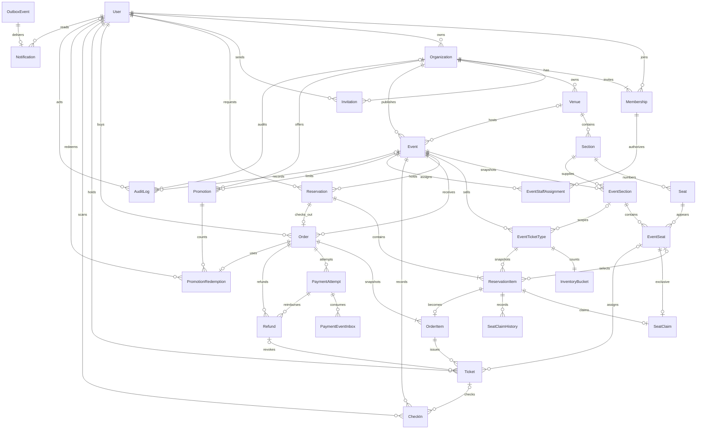

# Database model

All business identities are UUIDs. Financial relationships use PROTECT and database triggers; financial records are not hard-deleted. Temporary SeatClaim rows are released, with append-only SeatClaimHistory retaining transitions. The relational model below shows multiplicity; optional references include an event's venue, assigned ticket section/seat, ticket refund and audit actor/event.

## Constraints and indexes

- Case-insensitive unique User email via `Lower(email)`; unique organization slug and `(organization,user)` membership; role checks and protected owner.
- Unique venue section code; unique seat coordinates within section; section capacity bounds seat creation. Unique event slug within organization, section snapshot and numbered event seat.
- Valid event/sales timestamps; positive quotas, limits and nonnegative prices; one assigned ticket type per event section; one InventoryBucket per ticket type.
- `held >= 0`, `sold >= 0`, `held + sold <= capacity`; unique SeatClaim per event seat and reservation item. Unique selected seat inside a hold.
- Unique `(user,idempotency_key)` for holds/orders, `(order,idempotency_key)` for payments/refunds and `(scanner,idempotency_key)` for gate scans; replay fingerprint stored alongside every key.
- One order per reservation; snapshot item quantity/price/discount/total checks; order subtotal minus discount plus fees equals total. PostgreSQL trigger rejects changes to financial order fields and all OrderItem updates/deletes.
- One CREATED/PENDING/SUCCEEDED payment attempt per order; unique non-null `(provider,provider_payment_id)` and unique inbox `(provider,event_id)`.
- Unique `(order_item,admission_index)` admission; token hash and public code unique. One ACCEPTED check-in per ticket via partial uniqueness.
- Unique promotion redemption per order, explicit user/usage limits checked under the promotion row lock.
- Unique outbox deduplication key and in-app outbox association; reservation status/expiry and outbox retry timestamps indexed for workers. UUID/FK indexes support tenant joins.
- Database triggers reject updates/deletes to audit/history, deletes of orders/items/tickets/payment attempts/inbox/refunds. Model safeguards also reject prohibited ORM operations.

## Migrations

`accounts/0001_initial` defines the custom user before all references. Cross-app references are split into dependent migrations, then explicit constraint and trigger migrations. New migrations are additive. `payments/0002` persists the mock scenario for interrupted creation recovery. CI checks `makemigrations --check --dry-run` and applies all migrations on PostgreSQL 16.

Inspect actual definitions in `backend/apps/*/models.py` and `migrations/`; schema documentation does not replace those constraints. Trigger migration reversal removes the guards explicitly. Do not roll financial schemas back against new data without a tested backup/restore drill. Historical initial migrations use a deprecated Django check-constraint keyword but remain valid on the pinned 5.2 LTS runtime.
