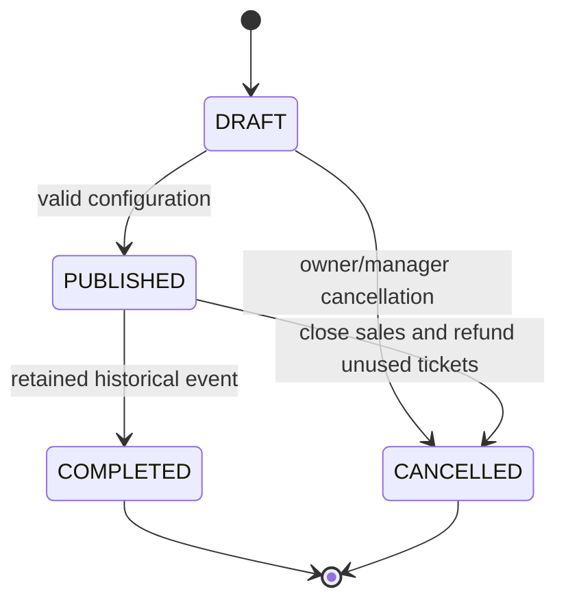
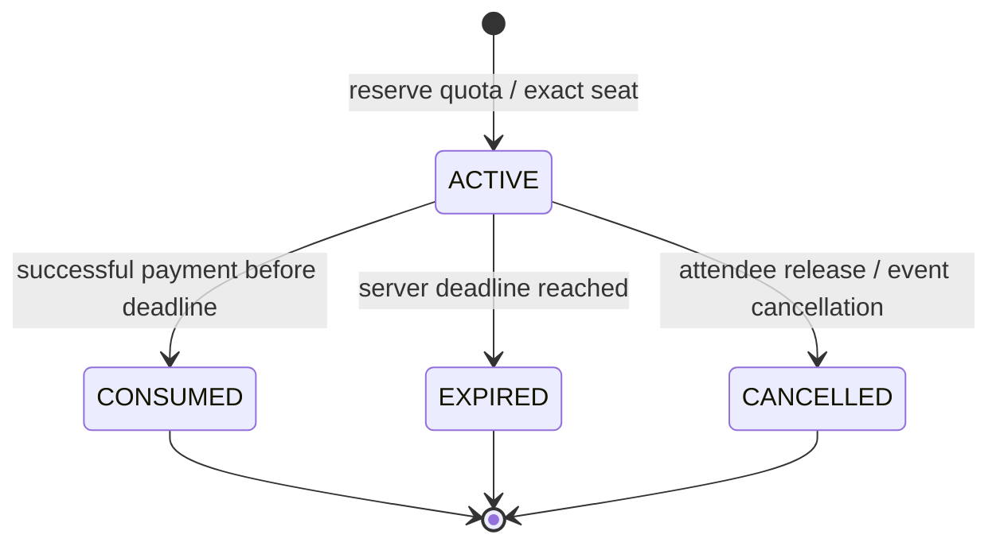

# Product and acceptance

Attendees discover events, verify an account, select quantities/exact seats, receive a short hold, pay in test mode and view private admission tickets. Organizers build venues and events, invite role-bound teams, publish inventory and review/refund orders. Assigned scanners perform online admission. Finance reads reconciled reports. Platform administrators moderate explicitly without automatically becoming tenant operators.

Orders move PENDING → PAYMENT_PROCESSING → PAID or FAILED/EXPIRED/CANCELLED. Late provider success keeps admission closed and creates a compensating refund. A PAID order becomes PARTIALLY_REFUNDED or REFUNDED. Tickets move VALID → USED, REVOKED or REFUNDED; refunded inventory is released once only when resale policy permits. A completed event is historical; there is no public hard-delete financial workflow.

Acceptance invariants: at most one active claim for a seat; held plus sold never exceeds GA capacity; expiry releases once; no tickets for failed/late payment; a repeated payment event issues once; concurrent scanners accept once; refunds never exceed paid allocated value; foreign tenants cannot access private records; mock checkout needs no external keys. These are verified with service/database tests and browser journeys, not frontend counters.
